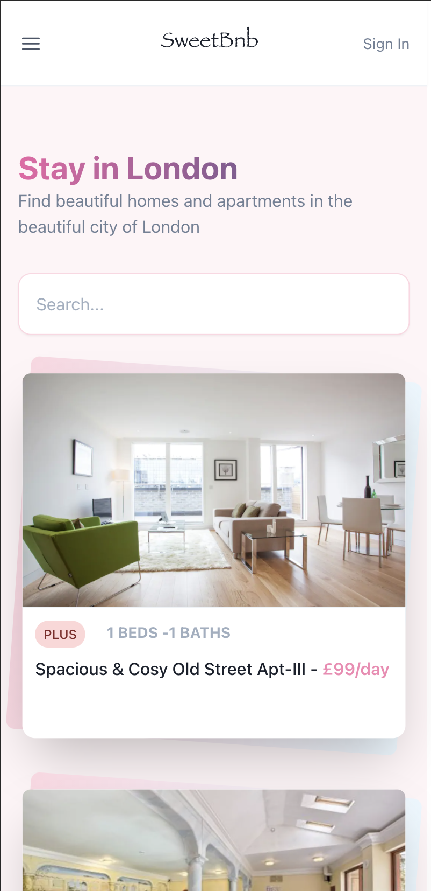

## SweetBnb
This is my third interation of an Airbnb clone. I originally learnt React 5 years ago by building such a clone and now that I have gotten better as a developer I decided to nostalgically build this again with my updated design and development skill.

## Tech Stack
 - Chakra-ui
 - Next.js
 - Easy Peasy
 - React Hook Form 
 - Testing with jest
 - Built with data from [Open DataSoft](https://public.opendatasoft.com/explore/dataset/airbnb-listings/api/?disjunctive.host_verifications&disjunctive.amenities&disjunctive.features&refine.country=United+Kingdom)

 ## Screenshots
 

## Todo
[ ] Complete search functionality